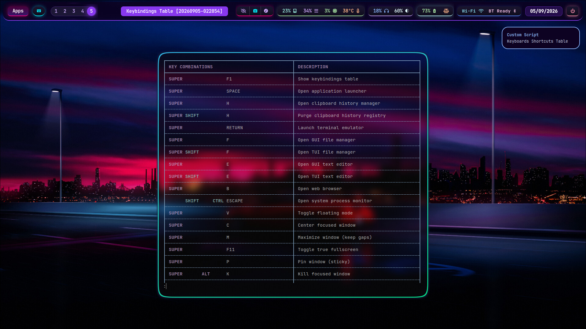

# Keybinding Registry & System Mapping

This document details the hotkey architecture, runtime dispatchers, and visualization pipeline configured within the Hyprland compositor environment.

## Subsystem Architecture & Implementation

The keybinding infrastructure relies on three interacting components designed to separate registration logic, internal state mapping, and user interface rendering:

1. [**`modules/keybindings.lua`**](./.config/hypr/modules/keybindings.lua):
   The primary entry point where human-readable keybindings are declared.
   It defines modifiers (`SUPER`), system calls, window management functions, and multimedia dispatchers.
   Instead of making [`Hyprland API`](https://wiki.hypr.land/Configuring/) calls directly, it passes definitions to the (custom) mapping layer.

3. [**`modules/keybindings-map.lua`**](./.config/hypr/modules/keybindings-map.lua) (_Wrapper Layer_):
   An intermediate abstraction module.
   When active in ***Registry Mode***, it wraps _Hyprland_'s `hl.bind()` calls and maintains an internal lookup table of all defined keybindings, actions, and their associated descriptions.
   Upon execution, it exports this data structure into a structured _JSON_ payload (`/tmp/hypr_binds.json`).

5. [**`hypr-binds-map.sh`**](./.config/hypr/scripts/hypr-binds-map.sh) (_TUI_ Visualizer Execution Script):
   A [_Zsh_](https://www.zsh.org/) execution script invoked via `SUPER + F1`.
   It reads the generated `/tmp/hypr_binds.json` snapshot, formats the key-value pairs using terminal utilities (such as `jq` or custom formatting parsers), and spawns an interactive _TUI_ overlay window displaying the active binding matrix in real time.

---

## Execution Modes

Toggled at the top of `modules/keybindings.lua`, the binding engine supports two execution modes:

- **Direct Dispatch Mode (`local map = hl`)**: Bypasses the internal _mapping wrapper_ and binds keys directly to the [_Hyprland C++ API_](https://wiki.hypr.land/Configuring/). Used for maximum execution speed or troubleshooting.
- **Registry Mode [`local map = require("modules.keybindings-map")`]**: Enables key interception and _JSON_ state export to power the _TUI_ visualizer (`SUPER + F1`).

---

## Command Dispatch Matrix

<em>Interactive TUI Keybindings Visualizer invoked via</em> SUPER + F1

 

Always refer to [`keybindings.lua`](./.config/hypr/modules/keybindings.lua) for the most updated _keybindings_ !

 

| STATUS | KEY COMBINATIONS | DESCRIPTION |
| :---: | :--- | :--- |
| 🟢 | `SUPER + F1` | Show keybindings table |
| 🟢 | `SUPER + Space` | Open application launcher |
| 🟢 | `SUPER + H` | Open clipboard history manager |
| 🟢 | `SUPER + SHIFT + H` | Purge clipboard history registry |
| 🔴 | `SUPER + SHIFT + ALT + Y` | Display the AETHER logo (debug) |
| 🟢 | `SUPER + Return` | Launch terminal emulator |
| 🟢 | `SUPER + F` | Open GUI file manager |
| 🟢 | `SUPER + SHIFT + F` | Open TUI file manager |
| 🟢 | `SUPER + E` | Open GUI text editor |
| 🟢 | `SUPER + SHIFT + E` | Open TUI text editor |
| 🟢 | `SUPER + B` | Open web browser |
| 🟢 | `CTRL + SHIFT + Escape` | Open system process monitor |
| 🟢 | `SUPER + V` | Toggle floating mode |
| 🟢 | `SUPER + C` | Center focused window |
| 🟢 | `SUPER + M` | Maximize window (keep gaps) |
| 🟢 | `SUPER + F11` | Toggle true fullscreen |
| 🟢 | `SUPER + P` | Pin window (sticky) |
| 🟢 | `SUPER + ALT + K` | Kill focused window |
| 🟢 | `SUPER + J` | Toggle horizontal/vertical split |
| 🟢 | `SUPER + L` | Toggle pseudo-tiling |
| 🟢 | `SUPER + left` | Focus window left |
| 🟢 | `SUPER + right` | Focus window right |
| 🟢 | `SUPER + up` | Focus window up |
| 🟢 | `SUPER + down` | Focus window down |
| 🟢 | `SUPER + SHIFT + left` | Move window left |
| 🟢 | `SUPER + SHIFT + right` | Move window right |
| 🟢 | `SUPER + SHIFT + up` | Move window up |
| 🟢 | `SUPER + SHIFT + down` | Move window down |
| 🟢 | `SUPER + ALT + left` | Shrink window width |
| 🟢 | `SUPER + ALT + right` | Expand window width |
| 🟢 | `SUPER + ALT + up` | Shrink window height |
| 🟢 | `SUPER + ALT + down` | Expand window height |
| 🟢 | `SUPER + [1-9, 0]` | Switch to workspace 1-10 |
| 🟢 | `SUPER + SHIFT + [1-9, 0]` | Move window to workspace 1-10 |
| 🟢 | `SUPER + S` | Toggle magic scratchpad |
| 🟢 | `SUPER + SHIFT + S` | Move window to scratchpad |
| 🟢 | `SUPER + SHIFT + D` | Detach from workspace (move 0) |
| 🟢 | `XF86MonBrightnessUp` | Increase backlight |
| 🟢 | `XF86MonBrightnessDown` | Decrease backlight |
| 🟢 | `XF86AudioRaiseVolume` | Increase volume |
| 🟢 | `XF86AudioLowerVolume` | Decrease volume |
| 🟢 | `XF86AudioMute` | Toggle mute for playback |
| 🟢 | `XF86AudioMicMute` | Toggle mute for microphone |
| 🟢 | `XF86AudioNext` | Next track |
| 🟢 | `XF86AudioPause` | Pause playback |
| 🟢 | `XF86AudioPlay` | Play playback |
| 🟢 | `XF86AudioPrev` | Previous track |
| 🔴 | `SUPER + SHIFT + A` | Launch the 'futuristic audio session' |
| 🔴 | `SUPER + SHIFT + ALT + A` | Terminate the 'futuristic audio session' |
| 🟢 | `SUPER + ALT + W` | Set a random image as new wallpaper |
| 🟢 | `Print` | Capture screenshot |
| 🟢 | `SHIFT + Print` | Capture screenshot to clipboard |
| 🟢 | `SUPER + F8` | Start screen recording |
| 🟢 | `SUPER + F9` | Pause screen recording |
| 🟢 | `SUPER + F10` | Stop screen recording |
| 🟢 | `SUPER + SHIFT + R` | Toggle or restart status bar |

---

### Status Legend & Modular Configuration

- **🟢 (Active)**: Indicates hotkeys that are natively registered and operational in the system runtime upon deployment.
- **🔴 (Disabled/Optional)**: Indicates _dormant_ keybindings. These correspond to user-specific scripts or optional dependencies.
  They are commented out by default in `modules/keybindings.lua` to prevent execution failures on environments where secondary scripts are absent.
  To enable them, uncomment the relative `map.bind` calls and reload the compositor configuration.
