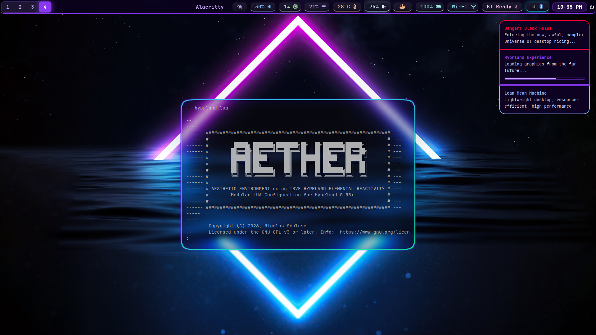
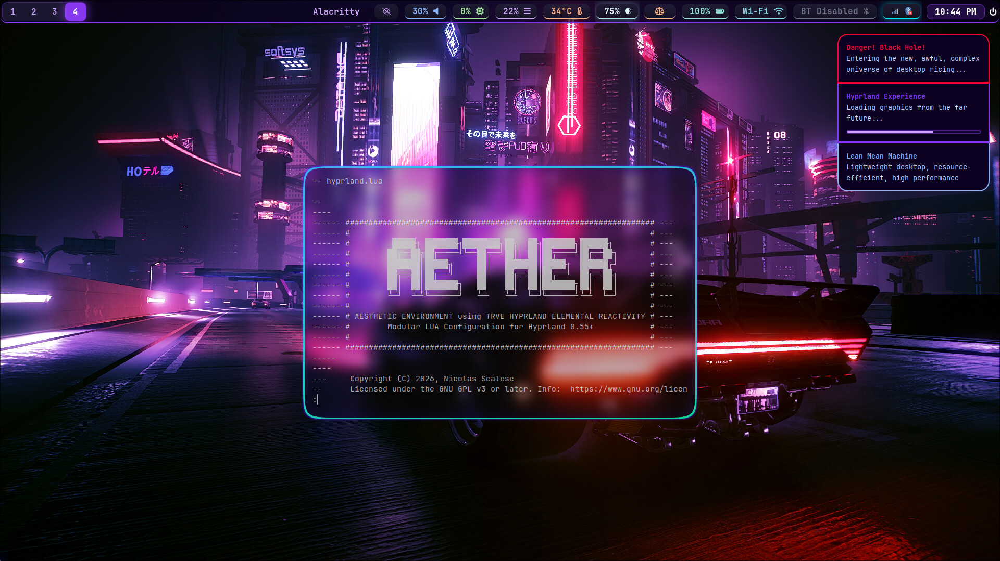
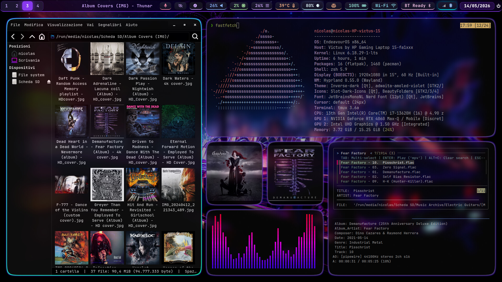
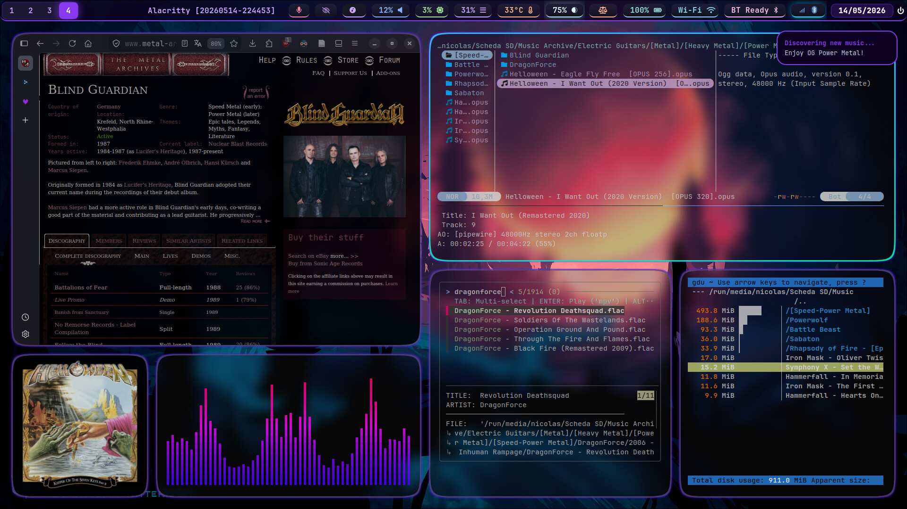
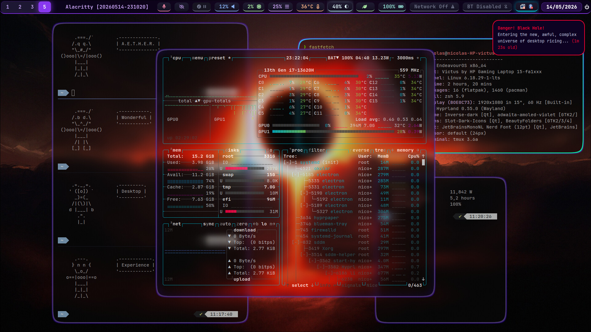
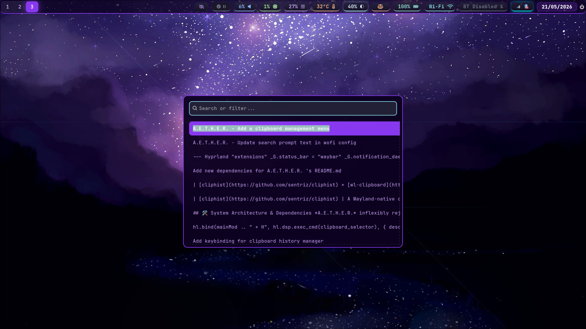

# A.E.T.H.E.R. project - Aesthetic Environment using Trve Hyprland Elemental Reactivity


> **"Firmitas, Utilitas, Venustas."** *(Strength, Utility, Beauty)*
> — Marcus Vitruvius Pollio, Ancient Roman Architect & Engineer

> **"Non quia difficilia sunt non audemus, sed quia non audemus difficilia sunt."** *(It is not because things are difficult that we do not dare; it is because we do not dare that they are difficult.)*
> — Lucius Annaeus Seneca, Roman Philosopher


*A.E.T.H.E.R.* is an avant-garde digital ecosystem engineered for the [*Hyprland*](https://hypr.land/) paradigm, 
directly [written in *Lua* for version 0.55 and later](https://hypr.land/news/26_lua/).
It represents the ultimate synthesis of raw performance and uncompromising cyber-aestheticism, a modern manifestation of classical Roman structural rigor 
blended with the neon-drenched, high-fidelity atmosphere of Cyberpunk, Outrun, and Synthwave movements.

Built strictly upon the principles of "*Keep It Simple, Stupid* (*K.I.S.S.*)" paradigm and the architectural law of *Less is More*, 
*A.E.T.H.E.R.* treats your operating system as an open alchemical canvas. 
By stripping away heavy desktop environment abstraction layers and translating system actions into lean, declarative *Lua* logic, 
this environment channels your hardware's computing capacity straight into user intent. 
No latency. No compromises. Just pure, unadulterated computational flow.


---


## 👁️ Visual Showcase

*A.E.T.H.E.R.* 's visual grammar relies on obsidian backdrops punctuated by high-contrast neon accents, electric cyan indicators, and floating glass geometries. 
Every layout is mathematically balanced to maximize screen real estate while protecting user focus.



<p align="center"><em>A.E.T.H.E.R. at startup: default wallpaper with logo; plus notification styles (low, normal, critical)</em></p>


<p align="center"><em>Another wallpaper, A.E.T.H.E.R. logo, notification styles (low, normal, critical)</em></p>


<p align="center"><em>An example of "ricing art" using the "mosaic style" in the Hyprland style</em></p>


<p align="center"><em>Another example of "digital desktop art" you can mimic using A.E.T.H.E.R.</em></p>


<p align="center"><em>This desktop setup leverages the Hyprland floating/pseudo windows instead</em></p>

Other beautiful ricing screenshots are provided in the ["*screenshots*"](./screenshots) folder.


---


## 🛠️ System Architecture & Dependencies

*A.E.T.H.E.R.* inflexibly rejects unnecessary complexity.
To build a system that achieves maximum stability (*Firmitas*) and utility (*Utilitas*), the dependencies are strictly categorized.

Before deploying *A.E.T.H.E.R.*, please review the [official Hyprland getting-started guide](https://wiki.hypr.land/Getting-Started/Installation/) 
to acknowledge which fundamental dependencies you need for running "basic" *Hyprland*.


### Essential Components

Without these core pillars, the *A.E.T.H.E.R.* environment cannot initialize or maintain architectural integrity.

| Program | Ecosystem Role |
| :--- | :--- |
| [Alacritty](https://alacritty.org/) | The GPU-accelerated terminal emulator acting as the default interface wrapper for all CLI interactions. |
| [Brightnessctl](https://github.com/Adisbladis/brightnessctl) | Screen backlight brightness adjustments tied directly to laptop hardware keys. |
| [Dunst](https://dunst-project.org/) | A low-overhead notification daemon configured for clean, geometric pop-up alerts. |
| [hypridle](https://github.com/hyprwm/hypridle) / [swayidle](https://github.com/swaywm/swayidle) | **Idle Management Daemons**: The core sub-systems driving automated display dimming and suspend activation. This project prefers `swayidle` as a rock-solid, C-based alternative; while maintaining full compatibility with `hypridle`. |
| [Hyprland](https://hyprland.org/) | The core dynamic tiling Wayland compositor and hardware-accelerated window layout engine. |
| [hyprpaper](https://github.com/hyprwm/hyprpaper) / [swaybg](https://github.com/swaywm/swaybg) | **Wallpaper Backends**: The core rendering layers for background imagery. The configuration defaults to `hyprpaper` for superior native resizing quality, while leaving `swaybg` fully configured as an on-the-fly Wayland alternative. |
| [polkit-gnome](https://archlinux.org/packages/extra/x86_64/polkit-gnome/) | The GTK3-based graphical authentication agent running in the background to handle elevated system privilege requests. |
| [qt6ct](https://github.com/trialuser02/qt6ct) | The central configuration controller forcing cross-toolkit UI elements to render via uniform theme rules. |
| [Waybar](https://github.com/Alexays/Waybar) | The primary CSS-styled telemetry bar, hosting custom script extensions and the interactive eye-pill inhibitor. |
| [Wireplumber](https://pipewire.pages.freedesktop.org/wireplumber/) (`wpctl`) | Audio engine controller driving PipeWire routing settings, hardware mute states, and volume levels. |
| [wlogout](https://github.com/ArtsyMacaw/wlogout) | A full-screen, minimal overlay menu executing clean power cycles, logouts, and sleep sequences. |
| [Wofi](https://hg.sr.ht/~scoopta/wofi) | A menu-driven application runner styled via custom stylesheets (`style.css`) to match the colorway. |


### Optional Components (The Extended Experience Stack)

These utilities enrich the ecosystem, providing advanced multimedia, file exploration, and lifestyle scripts.

| Program | Ecosystem Role |
| :--- | :--- |
| [btop](https://github.com/aristocratos/btop) | An interactive system monitor executing inside an isolated, floating window class wrapper (`floating_monitor`). |
| [cliphist](https://github.com/sentriz/cliphist) + [wl-clipboard](https://github.com/bugaevc/wl-clipboard) | **Clipboard Management Subsystem**: The combined stack driving Wayland-native copy/paste synchronization (`wl-clipboard`) alongside a local, text-bound historical data registry (`cliphist`). |
| [Grim](https://sr.ht/~emersion/grim/) + [Slurp](https://github.com/emersion/slurp) | Regional and full-display screen captioning utilities paired together for accurate crop selections. |
| [ImageMagick](https://imagemagick.org/) | Post-processing image engine (`magick` pipes) forcing raw window captures into highly compressed, 80-depth sRGB JPEGs. |
| [Librewolf](https://librewolf.net/) | A privacy-hardened browser customized to carry out clean web navigation without telemetry bloat. |
| [nm-applet](https://gitlab.gnome.org/GNOME/network-manager-applet) / [blueman](https://github.com/blueman-project/blueman) | Core tray indicators (`--indicator` hooks) providing unified network management and Bluetooth connectivity straight from the status bar. |
| [obs-cmd](https://github.com/norihiro/obs-cmd) | A command-line client mapping video capturing keybindings straight to a background OBS Studio recording socket. |
| [Playerctl](https://github.com/alols/playerctl) | A unified command-line media interface mapping global track tracking (Play/Pause/Next/Prev) controls. |
| [Thunar](https://docs.xfce.org/xfce/thunar/start) | A lightweight, responsive GTK-3 graphical file manager configured to blend into the universal dark theme. |
| [Yazi](https://github.com/sxyazi/yazi) | An asynchronous terminal file manager used for rapid, terminal-bound asset and workspace navigation. |
| [Zsh](https://www.zsh.org/) + [Tmux](https://github.com/tmux/tmux) | The combined shell ecosystem delivering automatic terminal nesting, workspace multiplexing, and session persistence. |


### Custom Scripts & Alchemical Automations

The TRVE spirit of *A.E.T.H.E.R.* thrives within its custom executable layer. Rather than relying on rigid, monolithic tools, the system coordinates actions through lightweight Shell scripts tethered straight to the Lua core engine.

| Program | Ecosystem Role |
| :--- | :--- |
| [futuristic-audio-session.sh](../../../dotfiles/shell/custom/.futuristic-audio-session) | **The Futuristic Audio Session**: A dedicated environment engineered for *TRVE music enthusiasts*. It orchestrates an isolated terminal workspace optimized for high-fidelity audio consumption and seamless binary toggle controls. |
| [hypr-binds-map.sh](./.config/hypr/scripts/hypr-binds-map.sh) | **Dynamic Keybindings Visualizer**: Intercepts live system mappings via `SUPER + F1` and instantly renders an interactive data table nested inside a distinct window class wrapper (`floating_bindsmap`). |
| [init-wallpaper.sh](./.config/hypr/scripts/init-wallpaper.sh) | **Static Canvas Initialization**: Executed automatically during the ecosystem's boot phase. It pre-loads and locks the foundational splash imagery using `hyprpaper`, ensuring a seamless, flicker-free visual transition before the dynamic wallpaper engine takes over. |
| [random-wallpaper-hypr.sh](../../../scripts/desktop-enhancements/random-wallpaper/random-wallpaper-hypr.sh) / [random-wallpaper-swaybg.sh](../../../scripts/desktop-enhancements/random-wallpaper/random-wallpaper-swaybg.sh) | **Change Wallpaper Randomly:** Driven by `SUPER + ALT + W`, these scripts inject life into the canvas by selecting a random graphical asset. The framework routes requests through `hyprpaper` by default for high-quality, hardware-accelerated image scaling; while maintaining an identical, fully operational `swaybg` fallback layout to preserve absolute desktop modularity. |


---


## ⌨️ The Command Center: Keybindings

Input handling inside *A.E.T.H.E.R.* follows a unified command pattern. 
Rather than distributing layout mappings across multiple fractured text layers, the interaction map is localized entirely within a [single script](./.config/hypr/modules/keybindings.lua):

📂 **`./.config/hypr/modules/keybindings.lua`**

To explore, alter, or enhance the keyboard layout, use this file as your definitive reference. 
Every map entry utilizes detailed descriptions that flow straight into the dynamic interactive menu mapping script.

Plus. once you have installed this "ricing", you can view keybindings in table format with relative description by pressing `SUPER + F1`:


### Architectural Interaction Features

- **Chronological Terminal Isolation**: Every time you invoke `SUPER + Return`, a new Alacritty interface opens.
  The configuration automatically titles the window with an instantaneous timestamp down to the second: `[$(date +'%Y%m%d-%H%M%S')]`. This facilitates perfect log tracking and terminal tracking management.
  
- **The "Magic" Workspace**: Accessible via `SUPER + S`, this acts as a scratchpad overlay,
  pulling minimized assets or hidden background operations instantly to the center of your screen without disrupting your active window layouts.
  
- **Clipboard History Menu**: Invoking `SUPER + H`, this macro invokes a high-performance, text-only clipboard engine. By piping `cliphist` straight through a streamlined `awk` parser, the system hides database index tracking numbers on the fly, rendering a pristine, unified history of your last copied assets inside a wide (`800px`) dedicated [Wofi](https://hg.sr.ht/~scoopta/wofi) container. Purge your clipboard history registry via `SUPER + SHIFT + H`.
  
  
- **[Futuristic Audio Session](https://github.com/ilNick-03/ArchLinux-alchemy)**: Triggered with `SUPER + SHIFT + A`, this macro launches a custom script environment inside your directory structures designed specifically for high-quality music listening experience. Closed typing `SUPER + SHIFT + ALT + A`.
  


---


## 💾 Installation & Deployment

Before modifying your desktop infrastructure, remember the core Roman architectural maxim: *ensure the foundation is secure before erecting the framework*. Deploying *A.E.T.H.E.R.* involves overwriting or linking configuration nodes. 


### 0. The Defensive Sentinel: Mandatory Backup Strategy
> [!TIP]
> Do not proceed without archiving your current user-space environments. Run the following command inside your terminal to generate an atomic, timestamped snapshot of your entire `.config` directory:

```bash
# Generate a compressed tarball backup with exact calendar tracking
tar -czf "$HOME/config-backup-$(date +%Y%m%d-%H%M%S).tar.gz" -C "$HOME" .config
```

> [!TIP]
> *If anything breaks during deployment, you can restore your pristine state instantly via*: 
    `tar -xzf ~/config-backup-*.tar.gz -C ~`


### 1. Cloning the Alchemical Repository
Acquire the source blueprint from the official distribution socket using `git`. This fetches the full alchemy stack repository:

```bash
git clone https://github.com/ilNick-03/ArchLinux-alchemy.git
cd ArchLinux-alchemy/ricing/Hyprland/AETHER
```


### 2. Choosing Your Deployment Vector

Depending on your dotfile management philosophy, choose **Vector Alpha** (Physical Isolation) or **Vector Beta** (Symlink Grafting).

#### Vector Alpha: Physical Decoupled Copying
Choose this if you want a standalone, immutable setup that completely cuts ties with the cloned repository folder.

- Step 1: Pre-initialize user space structures
```bash
mkdir -p "$HOME/.config/gtk-3.0"
```

- Step 2: Clear pre-existing conflicting directories
```bash
rm -rf "$HOME/.config/dunst" "$HOME/.config/hypr" "$HOME/.config/swayidle" "$HOME/.config/waybar" "$HOME/.config/wlogout" "$HOME/.config/wofi"
```

- Step 3: Physically deploy the configuration structures
```bash
cp -r .config/dunst "$HOME/.config/"
cp -r .config/hypr "$HOME/.config/"
cp -r .config/swayidle "$HOME/.config/"
cp -r .config/waybar "$HOME/.config/"
cp -r .config/wlogout "$HOME/.config/"
cp -r .config/wofi "$HOME/.config/"
```

- Step 4: Uniform older toolkit styling using the *A.E.T.H.E.R.* definition
```bash
cp .config/gtk-3.0/aether-win-menu.css "$HOME/.config/gtk-3.0/aether-win-menu.css"
```

#### Vector Beta: Symlink Grafting (Recommended for Developers)
Choose this if you want to actively track upstreams, pull repository updates, or push your own modifications back. This maps live links directly into your `.config` folder.

- Step 1: Pre-initialize user space structures
```bash
mkdir -p "$HOME/.config/gtk-3.0"
```

- Step 2: Clean legacy nodes to prevent multi-nesting link corruption
```bash
rm -rf "$HOME/.config/dunst" "$HOME/.config/hypr" "$HOME/.config/swayidle" "$HOME/.config/waybar" "$HOME/.config/wlogout" "$HOME/.config/wofi"
```

- Step 3: Inject live symbolic links targeting the A.E.T.H.E.R. blueprint
```bash
ln -s "$(pwd)/.config/dunst" "$HOME/.config/dunst"
ln -s "$(pwd)/.config/hypr" "$HOME/.config/hypr"
ln -s "$(pwd)/.config/swayidle" "$HOME/.config/swayidle"
ln -s "$(pwd)/.config/waybar" "$HOME/.config/waybar"
ln -s "$(pwd)/.config/wlogout" "$HOME/.config/wlogout"
ln -s "$(pwd)/.config/wofi" "$HOME/.config/wofi"
```

- Step 4: Link the custom GTK layout definition as the primary system stylesheet
```bash
ln -s "$(pwd)/.config/gtk-3.0/aether-win-menu.css" "$HOME/.config/gtk-3.0/aether-win-menu.css"
```


---


## 🚀 Post-Installation & Manual Adjustments

*A.E.T.H.E.R.* is configured out of the box for hybrid laptops, but requires minimal path alignment
to conform to your specific system layout.


### 1. Fetch Default Wallpaper & Initialize Background Canvas

Before booting the environment, you must manually acquire the default ecosystem wallpaper. 
- Open and follow the retrieval instructions detailed inside this [text file](./.config/hypr/splash.txt).
- Once downloaded, convert/rename it as `splash.jpg` and move it to `./.config/hypr/` folder. Otherwise, if you choose to store the asset in the non-standard directory
  and/or using the non-standard file name, ensure you update its absolute target path inside `./.config/hypr/modules/vars.lua` by re-targeting the initialization variable:

```lua
_G.init_WP = os.getenv("HOME") .. "/your/custom/path/default_wallpaper.jpg"
```


### 2. Re-align User Space Environmental Paths

Open your global variables configuration block located at `./.config/hypr/modules/vars.lua`.
Re-target the standard global variables to reflect your environment profile:

```lua
-- Set your relevant root directories
_G.home_dir     =  os.getenv("HOME")
_G.scripts_dir  =  os.getenv("HOME") .. "/scripts"  -- Points directly to your custom executable layers
```

Or specify a script' full path in the dedicated line of code.


### 3. Tailor Your Graphic Profile (Dual-GPU Configuration)

*A.E.T.H.E.R.* provides a split variable map to toggle hardware rendering profiles.
By default, paths are un-commented to utilize the integrated Intel graphics chip (`iGPU`) to optimize laptop battery life.

If you want to unlock the full power of an Nvidia dedicated card (`dGPU`), open `./.config/hypr/modules/vars.lua`,
comment out the Intel profile block, and un-comment the advanced Nvidia theming strategy block:

```lua
-- === Rendering with dGPU NVIDIA - performance ===
hl.env("LIBVA_DRIVER_NAME",         "nvidia")
hl.env("GBM_BACKEND",               "nvidia-drm")
hl.env("__GLX_VENDOR_LIBRARY_NAME", "nvidia")
```


### 4. Apply Unified Styling Across UI Engines

To prevent mixed fonts and inconsistent white window frames from breaking the Synthwave theme immersion,
confirm that `qt6ct` is running. The variable system forces Qt-based applications to read from this layer 
via the `QT_QPA_PLATFORMTHEME` environment variable, ensuring absolute style consistency across every app 
window on your screen.
Additionally, add these code lines inside your "$HOME/.config/gtk-3.0/gtk.css" to uniform the theme of apps using old GTK libraries (such as [Dunst](https://dunst-project.org/)):

```css
@import `aether-win-menu.css`
```


---


## ⚖️ License

This subproject is licensed under the GPL v3.0 License - protecting the freedom of the code for all users.

See the [LICENSE](../../../LICENSE) file for details.
