# A.E.T.H.E.R. by Nick - Aesthetic Environment using Trve Hyprland Elemental Reactivity


> **"Firmitas, Utilitas, Venustas."** *(Strength, Utility, Beauty)*
> — Marcus Vitruvius Pollio, Ancient Roman Architect & Engineer

> **"Non quia difficilia sunt non audemus, sed quia non audemus difficilia sunt."** *(It is not because things are difficult that we do not dare; it is because we do not dare that they are difficult.)*
> — Lucius Annaeus Seneca, Roman Philosopher


*A.E.T.H.E.R.* is an avant-garde digital ecosystem engineered for the [*Hyprland*](https://hypr.land/) paradigm, 
directly [written in *Lua* for version 0.55 and later](https://hypr.land/news/26_lua/).
It represents the ultimate synthesis of raw performance and uncompromising cyber-aestheticism, a modern manifestation of classical Roman structural rigor 
blended with the neon-drenched, high-fidelity atmosphere of Cyberpunk, Outrun, and Synthwave movements.

Built strictly upon the principles of "*Keep It Simple, Stupid* (*K.I.S.S.*)" paradigm and the architectural law of *Less is More*, 
*A.E.T.H.E.R.* treats your operating system as an open alchemical canvas. 
By stripping away heavy desktop environment abstraction layers and translating system actions into lean, declarative *Lua* logic, 
this environment channels your hardware's computing capacity straight into user intent. 
No latency. No compromises. Just pure, unadulterated computational flow.

Made in Italy 🇮🇹 with ❤️ .


<br>

---


## 👁️ Visual Showcase

*A.E.T.H.E.R.* 's visual grammar relies on obsidian backdrops punctuated by high-contrast neon accents, electric cyan indicators, and floating glass geometries. 
Every layout is mathematically balanced to maximize screen real estate while protecting user focus.


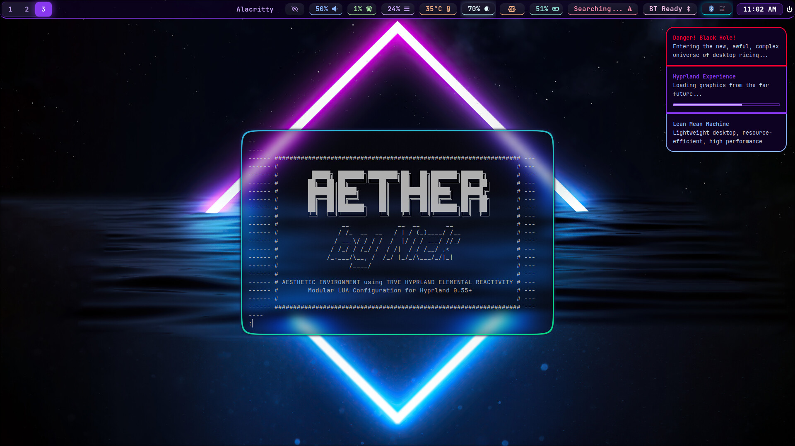
<p align="center"><em>A.E.T.H.E.R. at startup: default wallpaper with logo; plus notification styles (low, normal, critical)</em></p>

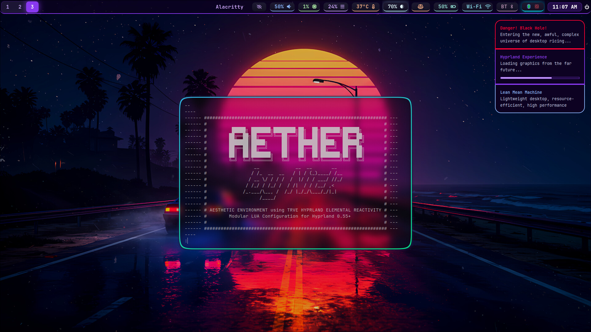
<p align="center"><em>A.E.T.H.E.R. logo on a "cyberpunk" setting, notification styles (low, normal, critical)</em></p>

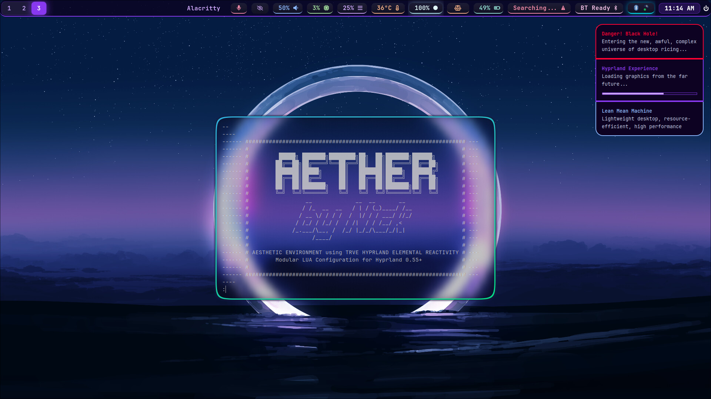
<p align="center"><em>A.E.T.H.E.R. logo on an "abstract" setting, notification styles (low, normal, critical)</em></p>

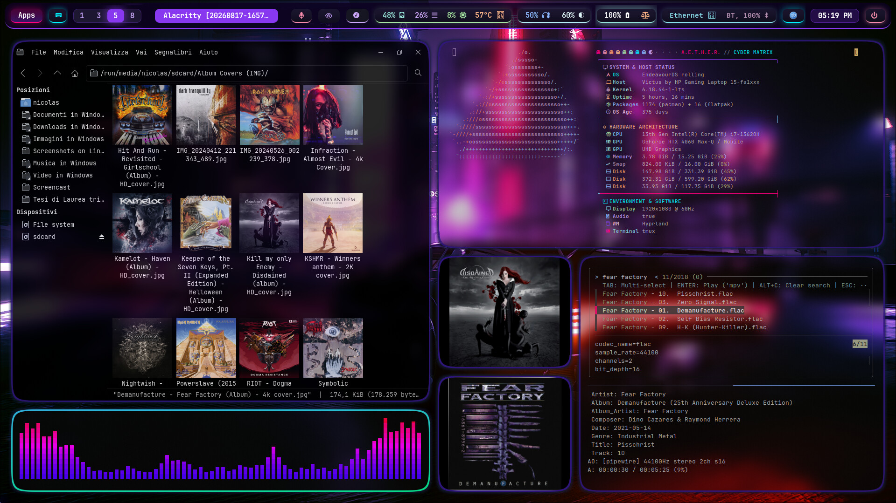
<p align="center"><em>An example of "ricing art" using the "mosaic style" in the Hyprland style</em></p>

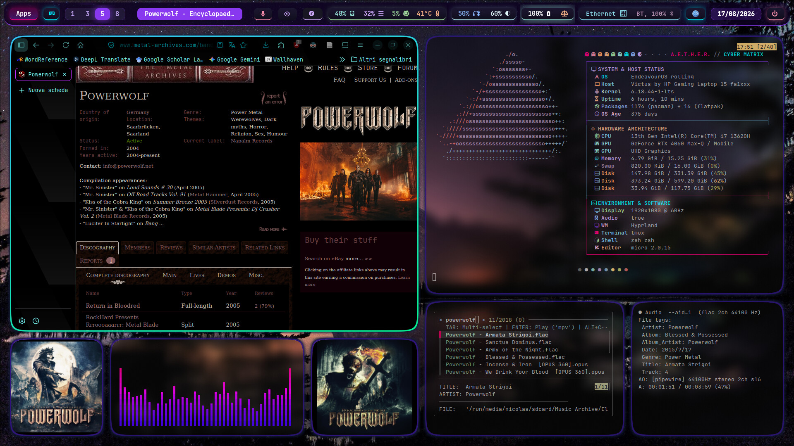
<p align="center"><em>Another example of "digital desktop art" you can mimic using A.E.T.H.E.R.</em></p>

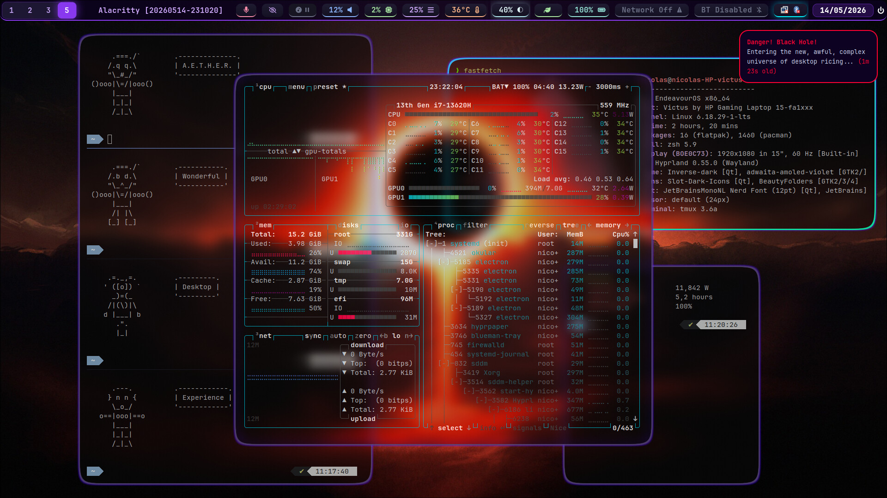
<p align="center"><em>This desktop setup leverages the Hyprland floating/pseudo windows instead</em></p>

Other beautiful ricing screenshots are provided in the ["*screenshots*"](./screenshots) folder.


<br>

---


## 🛠️ System Architecture & Dependencies

*A.E.T.H.E.R.* inflexibly rejects unnecessary complexity.
To build a system that achieves maximum stability (*Firmitas*) and utility (*Utilitas*), the dependencies are strictly categorized.

Before deploying *A.E.T.H.E.R.*, please review the [official Hyprland getting-started guide](https://wiki.hypr.land/Getting-Started/Installation/) 
to acknowledge which fundamental dependencies you need for running "basic" *Hyprland*.


### Essential Components

Without these core pillars, the *A.E.T.H.E.R.* environment cannot initialize or maintain architectural integrity.

| Program | Ecosystem Role |
| :--- | :--- |
| [Alacritty](https://alacritty.org/) | The _GPU_-accelerated terminal emulator acting as the default interface wrapper for all _CLI_ interactions. |
| [Brightnessctl](https://github.com/Adisbladis/brightnessctl) | Screen backlight brightness adjustments tied directly to laptop hardware keys. |
| [Dunst](https://dunst-project.org/) | A low-overhead notification daemon configured for clean, geometric pop-up alerts. |
| [HyprIdle](https://github.com/hyprwm/hypridle) / [SwayIdle](https://github.com/swaywm/swayidle) | **Idle Management Daemons**: The core sub-systems driving automated display dimming and suspend activation. This project prefers `swayidle` as a rock-solid, _C_-based alternative; while maintaining full compatibility with `hypridle`. Each is used within an abstraction layer (a shell script). |
| [Hyprland](https://hyprland.org/) | The core dynamic tiling Wayland compositor and hardware-accelerated window layout engine. |
| [HyprPaper](https://github.com/hyprwm/hyprpaper) / [SwayBG](https://github.com/swaywm/swaybg) | **Wallpaper Backends**: The core rendering layers for background imagery. The configuration defaults to `hyprpaper` for native compatibility and efficiency; while leaving `swaybg` as an on-the-fly _Wayland_ alternative. |
| [QT6CT](https://github.com/trialuser02/qt6ct) | The central configuration controller forcing cross-toolkit UI elements to render via uniform theme rules. |
| [Tmux](https://github.com/tmux/tmux) | The terminal multiplexer handling persistent terminal sessions, workspace isolation, and automated environment spawn logic across CLI tools. |
| [Waybar](https://github.com/Alexays/Waybar) | The primary _CSS_-styled status bar, hosting custom script extensions and the interactive hardware monitors, including suspend inhibitor. |
| [WirePlumber](https://pipewire.pages.freedesktop.org/wireplumber/) (`wpctl`) | Audio engine controller driving PipeWire routing settings, hardware mute states, and volume levels. |
| [WLogout](https://github.com/ArtsyMacaw/wlogout) | A full-screen, minimal overlay menu executing clean power cycles, logouts, and sleep sequences. |
| [Wofi](https://hg.sr.ht/~scoopta/wofi) | A menu-driven application runner styled via custom stylesheets, orchestrated via dedicated wrapper scripts for fast dynamic menu rendering. |
| [XFCE-Polkit](https://github.com/ncopa/xfce-polkit) / [Polkit-GNOME](https://archlinux.org/packages/extra/x86_64/polkit-gnome/) | **Authentication agents** running in the background to handle elevated system privilege requests. The setup defaults to the lightweight `xfce-polkit` which is Wayland-native, while preserving `polkit-gnome` as a rock-solid alternative as a fallback. |
| [Zsh](https://www.zsh.org/) | The primary command interpreter driving subshell execution, interactive terminal environments, and system automation scripts. |


### Optional Components (The Extended Experience Stack)

These utilities enrich the ecosystem, providing advanced multimedia, terminal-bound _IDE_ tools, file exploration, and lifestyle scripts.

| Program | Ecosystem Role |
| :--- | :--- |
| [Btop](https://github.com/aristocratos/btop) | An interactive system monitor executing inside an isolated, floating window class wrapper (`floating_monitor`). |
| [Cliphist](https://github.com/sentriz/cliphist) + [WL-Clipboard](https://github.com/bugaevc/wl-clipboard) | **Clipboard Management Subsystem**: The combined stack driving _Wayland_-native copy/paste synchronization alongside a local data registry, managed via `clipboard-selector.sh` for full content recovery. |
| [Grim](https://sr.ht/~emersion/grim/) + [Slurp](https://github.com/emersion/slurp) | Regional and full-display screen captioning utilities paired together for accurate crop selections. |
| [ImageMagick](https://imagemagick.org/) | Post-processing image engine (`magick` pipes) forcing raw window captures into highly compressed, 8-depth sRGB image files. |
| [Kate](https://kate-editor.org/) | A lightweight, feature-rich GTK/Qt graphical text editor suitable for quick code edits. |
| [Librewolf](https://librewolf.net/) | A privacy-hardened browser customized to carry out clean web navigation without telemetry bloat. |
| [Micro](https://micro-editor.github.io/) | A modern, intuitive, terminal-based text editor providing standard keybindings out of the box. |
| [Obs Studio](https://obsproject.com/download), alongside [obs-cmd](https://github.com/norihiro/obs-cmd) | A _GUI-based_ recording software for your desktop screen that works alongside a command-line client, mapping video capture keybindings straight to a background _OBS Studio_ recording _socket_. |
| [Playerctl](https://github.com/alols/playerctl) | A unified command-line media interface mapping global track tracking (Play/Pause/Next/Prev) controls. |
| [Thunar](https://docs.xfce.org/xfce/thunar/start) | A lightweight, responsive GTK-3 graphical file manager configured to blend into the universal dark theme. |
| [VSCodium](https://vscodium.com/) | A telemetry-free, open-source binary distribution of _VS Code_ for full-fledged graphical _IDE_ development. |
| [Yazi](https://github.com/sxyazi/yazi) | An asynchronous terminal file manager used for rapid, terminal-bound asset and workspace navigation. |


### Custom Scripts & Alchemical Automations

The TRVE spirit of *A.E.T.H.E.R.* thrives within its custom executable layer.
Rather than relying on rigid, monolithic tools, the system coordinates actions through lightweight _Shell scripts_ tethered straight to the Lua core engine.


| TIER | Script or Dotfile | Ecosystem Role |
| :---: | :--- | :--- |
| 🔵 | [.futuristic-audio-session](../../../dotfiles/shell/custom/.futuristic-audio-session) | A dedicated environment engineered for *TRVE music enthusiasts*. It orchestrates an isolated terminal workspace optimized for local-based, high-fidelity audio listening. |
| 🟣 | [apps-launcher.sh](./.config/hypr/scripts/apps-launcher.sh) | **Dynamic Application Launcher**: Invokes `wofi` asynchronously to display applications instantly |
| 🟣 | [clipboard-selector.sh](./.config/hypr/scripts/clipboard-selector.sh) | **Clipboard Management Wrapper**: Intercepts `cliphist` history entries, with a visual preview, and decodes full untruncated strings back into `wl-copy`. |
| 🟣 | [hypr-binds-map.sh](./.config/hypr/scripts/hypr-binds-map.sh) | **Dynamic Keybindings Visualizer**: Intercepts live system mappings via `SUPER + F1` and instantly renders an interactive data table nested inside a distinct window class wrapper (`floating_bindsmap`). |
| 🟣 | [hypr-bg-setter.sh](../../../scripts/desktop-enhancements/change-wallpaper/hypr-bg-setter.sh) / [sway-bg-setter.sh](../../../scripts/desktop-enhancements/change-wallpaper/sway-bg-setter.sh) | **Wallpaper Setter Pipes**: Wrappers that load and apply static image paths dynamically into the active wallpaper _daemon_. |
| 🟣 | [random-wallpaper-selector.sh](../../../scripts/desktop-enhancements/random-wallpaper-selector.sh) | **Random Canvas Selector**: Triggered via `SUPER + ALT + W`, this utility randomly selects a background asset from your wallpaper collection and pipes it straight into the active "_setter wrapper_". |

#### Legend:
* **🟣 (Mandatory)**: Essential automation scripts required for core desktop functionality.
* **🔵 (Optional)**: Opinionated functionalities, designed for specific lifestyle workflows, requiring user manual configuration.


<br>

---


## ⌨️ The Command Center: Keybindings

Input handling inside *A.E.T.H.E.R.* follows a unified command pattern. 
The interaction map is localized entirely within a [single Lua module](./.config/hypr/modules/keybindings.lua):

📂 **`./.config/hypr/modules/keybindings.lua`**

To explore, alter, or enhance the keyboard layout, use this file as your definitive reference. 
Every map entry utilizes detailed descriptions that flow straight into the dynamic interactive menu mapping script.

See [`Keybindings.md`](./Keybindings.md) to see a user-friendly _key combinations_ table, alongside more technical details.


<br>

### Architectural Interaction Features

- **Interactive Status Bar**: Powered by [***Waybar***](https://github.com/Alexays/Waybar), the modular pill-based interface combines system metrics, workspace switchers, media controls, and hardware toggles directly at the top of your screen. 
  For a full breakdown of gestures, tooltips, and modular design, check out the dedicated [**Status Bar Documentation**](./StatusBar.md).
  
  <p align="center"><em>Interactive, modular Waybar status bar architecture</em></p>

- **Interactive Keybindings Map**: Triggered via `SUPER + F1`, it intercepts live system mappings and instantly renders an interactive data table nested inside a distinct window class wrapper (`floating_bindsmap`).
  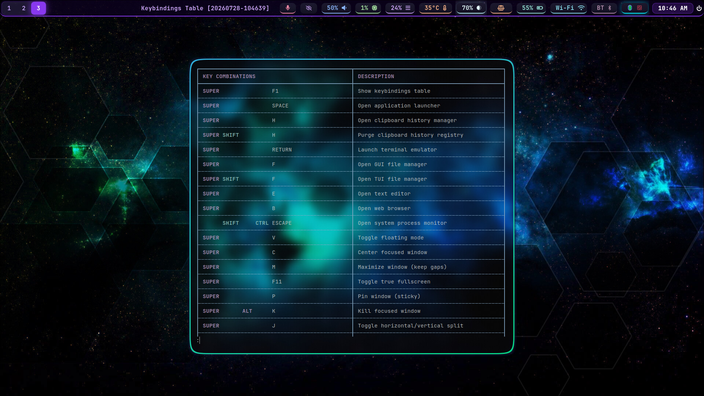
  <p align="center"><em>Interactive TUI keybindings table inside an isolated terminal window</em></p>

- **Dynamic Application Launcher**: Invoked via `SUPER + SPACE`, the system summons a fast, asynchronous application menu (`wofi`) styled with custom CSS to perfectly match the neon-drenched aesthetic.
  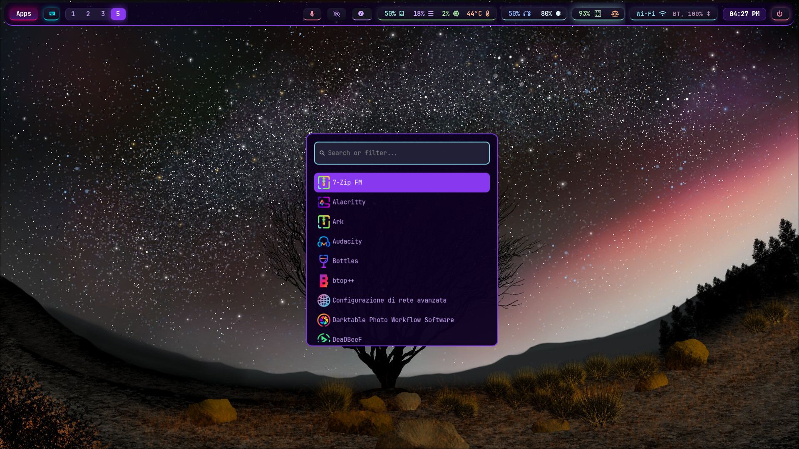
  <p align="center"><em>Dynamic application launcher triggered asynchronously</em></p>

- **Interactive Network Selection**: Accessible directly from the status bar or via keyboard shortcuts, this launches a dedicated floating terminal interface for quick, keyboard-driven Wi-Fi network management.
  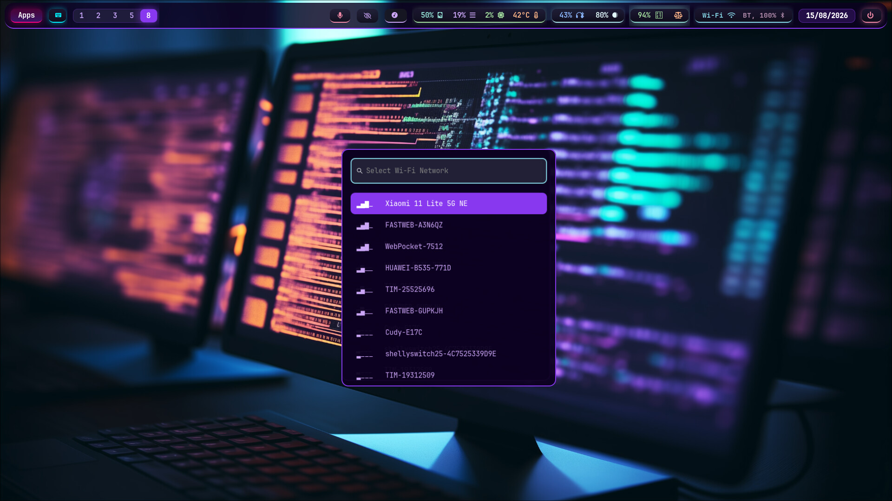
  <p align="center"><em>Terminal-based interactive Wi-Fi network selection menu</em></p>

- **Clipboard History Menu**: Invoking `SUPER + H`, this macro launches a high-performance, text-only clipboard engine. By piping `cliphist` straight through a streamlined `awk` parser, the system hides database index tracking numbers on the fly, rendering a pristine, unified history of your last copied assets inside a wide dedicated Wofi container. Purge your clipboard history registry via `SUPER + SHIFT + H`.
  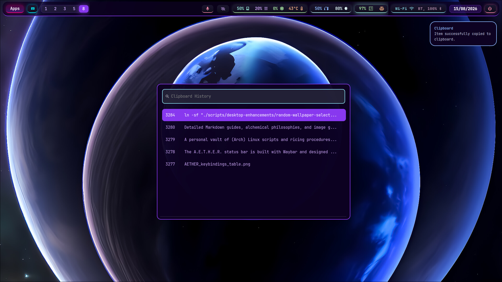
  <p align="center"><em>Clipboard history selector rendering full untruncated strings</em></p>

- **Chronological Terminal Isolation**: Every time you invoke `SUPER + Return`, a new [***Alacritty***](https://alacritty.org/) interface opens inside a [***Tmux***](https://github.com/tmux/tmux) session.
  The configuration automatically titles the window with an instantaneous timestamp down to the second: `[$(date +'%Y%m%d-%H%M%S')]`.
  This facilitates perfect log tracking and terminal tracking management.

- **Terminal _IDE_ Workspace**: Change `SUPER + E` keybinding to invoke [***VSCodium***]((https://vscodium.com/)), ready for intense programming sessions.
  
- **The "Magic" Workspace**: Accessible via `SUPER + S`, this acts as a scratchpad overlay,
  pulling minimized assets or hidden background operations instantly to the center of your screen without disrupting your active window layouts.
  
- **[Futuristic Audio Session](https://github.com/ilNick-03/ArchLinux-alchemy)**: Triggered with `SUPER + SHIFT + A`, this macro launches a custom script environment inside your directory structures designed specifically for high-quality music listening experience. Closed typing `SUPER + SHIFT + ALT + A`.
  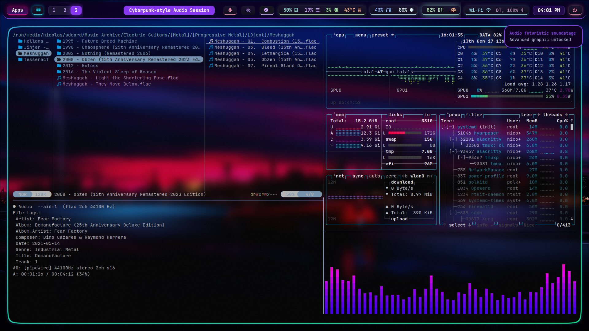


<br>

---

## 💾 Installation & Deployment

For detailed, step-by-step setup and configuration instructions, please refer to the **[Installation tutorial](./installation/Installation-guide.md)**.


<br>

---


## 🚀 Post-Installation & Manual Adjustments

*A.E.T.H.E.R.* is configured out of the box, but requires minimal path alignment and asset positioning to conform to your specific hardware layout.

### 1. Wallpaper Gallery Setup & Default Background Initialization

*A.E.T.H.E.R.* manages wallpaper rotation through native daemons (`hyprpaper` or `swaybg`) controlled via [hypr-bg-setter.sh](../../../scripts/desktop-enhancements/change-wallpaper/hypr-bg-setter.sh) / [sway-bg-setter.sh](../../../scripts/desktop-enhancements/change-wallpaper/sway-bg-setter.sh) and [random-wallpaper-selector.sh](../../../scripts/desktop-enhancements/random-wallpaper-selector.sh) ..

1. Read the [dedicated wallpaper guide]((./Wallpapers.md) ) to obtain the recommended high-resolution artwork collection.
2. Place your downloaded wallpapers into your preferred picture directory (e.g., `~/Pictures/Wallpapers/`).
3. Set your default startup wallpaper by placing an image named `splash.jpg` inside `$HOME/.config/hypr/` **OR** update the initial wallpaper path in `./.config/hypr/modules/vars.lua`:

```lua
-- Initial wallpaper rendered upon compositor startup
local initial_WP = os.getenv("HOME") .. "/.config/hypr/splash.jpg"
```


### 2. Align Environment Directories in [vars.lua](../../../ricing/Hyprland/AETHER/.config/hypr/modules/vars.lua)

Open the global variables module located at `./.config/hypr/modules/vars.lua`.
Confirm or update the script and wallpaper root directories to reflect your system layout:

```lua
-- Set your relevant root directories
_G.home_dir     =  os.getenv("HOME")
_G.scripts_dir  =  os.getenv("HOME") .. "/scripts"  -- Points directly to your custom executable layers
```

### 3. Tailor Your Graphic Profile (Dual-GPU Configuration)

*A.E.T.H.E.R.* provides a split variable map to toggle hardware rendering profiles.
If you are running an NVIDIA or Intel dedicated card (`dGPU`), open `./.config/hypr/modules/vars.lua`, un-comment the relative driver strategy:

```lua
-- === Rendering with dGPU NVIDIA - performance ===
hl.env("LIBVA_DRIVER_NAME",         "nvidia")
hl.env("GBM_BACKEND",               "nvidia-drm")
hl.env("__GLX_VENDOR_LIBRARY_NAME", "nvidia")
```


### 4. Apply Unified Styling Across UI Engines

To prevent mixed fonts and inconsistent white window frames from breaking the Synthwave theme immersion:

1. Confirm that `qt6ct` and/or `Kvantum` are configured as your primary theme engines.
2. If needed, uncomment `hl.env("QT_STYLE_OVERRIDE" , "kvantum")` in [vars.lua](../../../ricing/Hyprland/AETHER/.config/hypr/modules/vars.lua).
   The Lua configuration enforces `kvantum` theme across all _QT_-based _GUI_ applications.
4. Verify that your `$HOME/.config/gtk-3.0/gtk.css` file properly includes `@import url('aether-win-menu.css');` as configured during deployment.


<br>

---


## ⚖️ License

This subproject is licensed under the GPL v3.0 License - protecting the freedom of the code for all users.

See the [LICENSE](../../../LICENSE) file for details.
