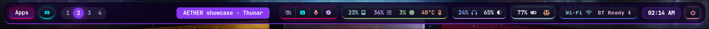

# Status Bar Architecture & Module Directory

The **_A.E.T.H.E.R._** status bar is built with _Waybar_ and engineered as a modular, pill-based interactive interface. Modules are organized logically from left to right, seamlessly combining real-time hardware telemetry, quick-action controls, privacy sentinels, and system dispatchers.

  

 

> [!NOTE]
> The screenshot above represents the **latest, active design and layout** of the status bar. Please always refer to this live visual preview and documentation as the up-to-date baseline reference for module structure and styling.

 

---

## Left Modules: System Navigation & Workspaces

* **Application Launcher (`custom/apps-launcher`)**
  * **Function**: Serves as the primary system application launcher trigger.
  * **Interactions**: Left-click launches the graphical application launcher menu.
  * **Visuals**: Highlighted with a distinct cyber-pink gradient pill, rounded border accents, and active hover glow.

* **Keybindings Cheat-Sheet (`custom/binds-table`)**
  * **Function**: Provides instant access to system-wide shortcuts.
  * **Interactions**: Left-click launches an interactive TUI keybindings table in an isolated floating terminal window.
  * **Visuals**: Styled in a dedicated high-radius pill with a cyan accent border and glow.
  * **Tooltip**: Displays "Keybindings Cheat-Sheet" on hover.

* **Workspace Switcher (`workspaces`)**
  * **Function**: Displays active and populated Hyprland workspaces.
  * **Interactions**: Left-click a workspace badge to switch directly to it; scroll up or down anywhere on the container to cycle through workspaces sequentially.
  * **Visuals**: Features a rounded pill frame with extra horizontal padding. Highlights the active workspace with a solid primary violet fill and halo glow.

 

---

## Center Module: Contextual Window Management

* **Active Window Title (`window`)**
  * **Function**: Displays the title of the currently focused window.
  * **Behavior**: Automatically truncates overly long window titles. The pill completely collapses and hides when the current workspace contains no active windows.

 

---

## Right Modules & Consolidated Control Groups

### 1. Consolidated Module Groups

| Module Group | Component | Functionality & Gestures | Tooltip & Alerts |
| :--- | :--- | :--- | :--- |
| **Multimedia & Privacy** | **Idle Inhibitor (`idle_inhibitor`)** | Permanent anchor for the group. Left-click toggles between screen auto-suspend and always-on mode. | Tooltip indicates "Always-on screen" or "Auto suspend". |
| | **Camera Sentinel (`custom/cam`)** | Hardware video capture monitor. Displays a cyan camera icon when a webcam node is active. | Displays active video capture indicator on hover. |
| | **Microphone Privacy (`privacy`)** | Hardware audio input monitor. Dynamically reveals a red microphone icon when audio recording is active. | Indicates active audio capture streams. |
| | **Media Player (`mpris`)** | Detects active media playback. Left-click toggles Play/Pause; right-click skips to the next track. | Tooltip displays active player identity, track status, artist, and album metadata. |
| **Hardware Monitors** | **Disk (`custom/disk`)** | Shows percentage of root partition used. Left-click triggers an immediate storage usage recalculation. | Tooltip displays exact used vs. total disk space (e.g., `185G / 460G`). |
| | **Memory (`memory`)** | Monitors total RAM utilization percentage in real-time. | Native Waybar memory statistics tooltip. |
| | **CPU (`cpu`)** | Displays overall CPU usage load percentage. | None (clean layout). |
| | **Temperature (`temperature`)** | Tracks thermal sensors. Colors shift dynamically and flash when temperature exceeds 80°C. | None (clean layout). |
| **Hardware Controls** | **Audio (`pulseaudio`)** | Scroll up/down to adjust volume by 2% (capped at 100% ceiling via WirePlumber); left-click toggles Mute; right-click opens `pavucontrol`. | Displays active audio output device and current volume percentage. |
| | **Backlight (`backlight`)** | Scroll up/down to adjust screen brightness by 5%; left-click decreases, right-click increases brightness. | None (clean layout). |
| **Power Management** | **Battery (`battery`)** | Tracks charge levels and AC state. Animates red when critical (<15%) and turns green when charging. | Tooltip displays calculated remaining battery life / time to full charge. |
| | **Power Profile (`power-profiles-daemon`)** | Scroll up/down to switch system profiles (*Power Saver* , *Balanced* , *Performance* ). | Tooltip shows current profile name and system driver. |
| **Connectivity** | **Wi-Fi (`network`)** | Left-click toggles Wi-Fi radio state On/Off; right-click opens the interactive network selection menu. | Tooltip displays active interface, local IP, and gateway addresses. |
| | **Bluetooth (`bluetooth`)** | Left-click toggles Bluetooth radio On/Off; right-click opens the Bluetooth device manager. | Tooltip lists connected devices, MAC addresses, and battery levels. |

 

---

### 2. System Utility & End Modules

* **System Tray (`tray`)**
  * **Function**: Hosts passive system applet icons (e.g., NetworkManager, Blueman, background sync services).
  * **Behavior**: Automatically collapses and hides when no active system applets are running.

* **Clock & Calendar Badge (`clock`)**
  * **Function**: Primary timekeeper displaying time in 12-hour format with AM/PM indicators.
  * **Interactions**: Left-click toggles the main time display to alternative date formats (e.g., `DD/MM/YYYY`).
  * **Tooltip**: Hovering reveals a formatted calendar overlay for the current month.

* **Power Operations (`custom/power`)**
  * **Function**: Quick-access session and power management dispatcher.
  * **Interactions**: Left-click launches the full-screen system power menu (logout, reboot, shutdown, suspend lock).
  * **Visuals**: Highlighted in red with a soft-rounded pill shape and an intensified glow effect on hover.
